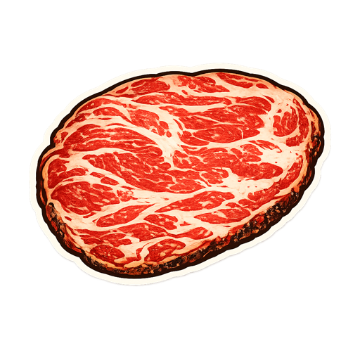
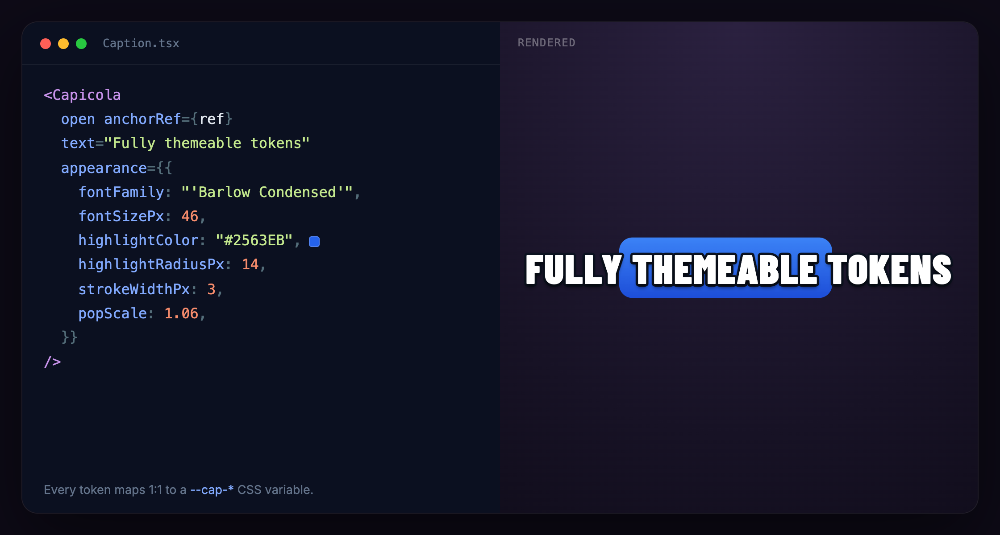

<p align="center"></p>

<h1 align="center">Capicola</h1>

<p align="center">TikTok/CapCut-style narrated captions that sweep a highlight word-by-word, pinned to any element.</p>

<p align="center">
  <a href="https://www.npmjs.com/package/capicola"></a>
  <a href="https://www.npmjs.com/package/capicola"></a>
  <a href="https://bundlephobia.com/package/capicola"></a>
  <a href="./LICENSE"></a>
  
</p>

---

**Capicola** is a self-contained React component that renders a narrated, word-by-word caption — the animated karaoke style you see on TikTok and CapCut — and pins it to any anchor element on the page. Feed it plain text and it paces the highlight itself with a research-tuned cadence model; feed it word-level timings plus an audio file and the highlight rides the narration exactly. It ships four ready-made presets, is fully themeable through typed tokens or raw CSS variables, and depends on nothing but React and `react-dom`.

<!-- TODO: add DEMO GIF — the four presets flipping (box → color → bubble → plain) on the same line.
     Record at 2× device pixel ratio, keep it under ~4 MB, and drop it here:
<p align="center"></p>
-->

## Features

- **Two drive modes** — silent *cadence* mode (just pass `text`) or synced *audio* mode (pass `words` + `audioSrc`).
- **Self-contained** — runtime deps are React and `react-dom` only. No design-system imports, no CSS-in-JS runtime. The component renders through `createPortal` into `document.body`.
- **Themeable, two ways** — a typed `appearance` prop or raw `--cap-*` CSS custom properties. Every token maps 1:1 to a variable.
- **Four presets** — `box`, `color`, `bubble`, `plain`, each a full bundle of tokens you can still override.
- **Anti-jitter by design** — the highlight is a paint change over constant padding; the pop is a compositor `transform: scale()`. Nothing reflows per word, ever.
- **Smart anchoring** — a 3×3 anchor grid plus collision-aware `auto` vertical placement that flips above/below to stay on-screen and tracks the anchor as the page scrolls.
- **CapCut-style chunking** — group words into on-screen "pages" by pause or by box width, with sentence-aware breaks and a max-lines cap.
- **Accessible & motion-aware** — `aria-live` region, `aria-current` on the active word, and full `prefers-reduced-motion` support.
- **Caption CLI** — `npx capicola-caption` generates word timings from existing audio (WhisperX) or from TTS with word marks (Amazon Polly, ElevenLabs).

## Install

```sh
# npm
npm install capicola

# pnpm
pnpm add capicola

# yarn
yarn add capicola
```

`react` and `react-dom` are **peer dependencies** (`>=18`). Capicola uses `createPortal`, so both must be present in your app.

You must also import the stylesheet **once**, anywhere in your app entry:

```ts
import "capicola/styles.css"
```

The stylesheet ships separately from the JS so you control where it lands in your cascade. It defines every `--cap-*` default (the reference "tiktok-pink" look).

## Quickstart

### Cadence mode (no audio)

Pass `text` and Capicola computes per-word timings from its cadence model.

```tsx
import { useRef } from "react"
import { Capicola } from "capicola"
import "capicola/styles.css"

function Example() {
  const anchor = useRef<HTMLDivElement>(null)
  return (
    <div>
      <div ref={anchor}>Anchor me</div>
      <Capicola
        open
        anchorRef={anchor}
        text="This caption paces itself, word by word."
      />
    </div>
  )
}
```

### Audio mode (synced to narration)

Pass `words` (word-level timings, in seconds) and an `audioSrc`. The highlight is driven from the audio element's `currentTime`. A `CaptionData` JSON from the [caption CLI](#caption-cli) spreads straight in.

```tsx
<Capicola
  open
  anchorRef={anchor}
  audioSrc="/narration.mp3"
  words={[
    { text: "This", start: 0.0, end: 0.32 },
    { text: "rides", start: 0.34, end: 0.71 },
    { text: "the", start: 0.72, end: 0.83 },
    { text: "audio.", start: 0.85, end: 1.4 },
  ]}
/>

// …or with a generated caption file:
// import caption from "./narration.caption.json"
// <Capicola open anchorRef={anchor} {...caption} />
```

## Presets

Set `preset` to pick a named style template, then override any individual token with `appearance` (appearance wins). Tokens are orthogonal, so combinations Just Work — e.g. `preset="bubble"` plus an `appearance.highlightColor` gives a per-word box on top of a line bubble.

| Preset | Description |
|--------|-------------|
| `box` | Condensed heavy caps with a pink gradient box behind the active word. The signature look (also the stylesheet default). |
| `color` | Heavy Inter with a black outline; the active word recolours to gold — no box. |
| `bubble` | Clean semibold Inter, no outline, on a translucent dark bubble behind the whole line. Subtitle-sized. |
| `plain` | Heavy Inter with a black outline and no per-word highlight or pop at all. |

```tsx
// Preset as-is:
<Capicola open anchorRef={anchor} text="…" preset="bubble" />

// Preset + targeted overrides:
<Capicola
  open
  anchorRef={anchor}
  text="…"
  preset="color"
  appearance={{ highlightTextColor: "#38BDF8", fontSizePx: 40 }}
/>
```

> Note: when no `preset` is set, the component renders the stylesheet defaults directly — which closely match the `box` look.

## Props / API reference

### `CapicolaProps`

| Prop | Type | Default | Description |
|------|------|---------|-------------|
| `open` | `boolean` | — (required) | Mounts + plays when `true`; resets and hides when `false`. |
| `anchorRef` | `React.RefObject<HTMLElement \| null>` | — (required) | The element the caption is positioned against. |
| `audioSrc` | `string` | `undefined` | Audio-mode narration URL/path. Provide alongside `words`. |
| `words` | `WordTiming[]` | `undefined` | Audio-mode word timings (seconds). When present, drives the highlight from the audio clock. |
| `text` | `string` | `undefined` | Cadence-mode text; per-word timings are computed from `cadence`. |
| `cadence` | `CadenceOptions` | see below | Tuning for cadence mode's per-word pacing. |
| `chunking` | `ChunkingOptions` | see below | How words are grouped into on-screen pages. |
| `width` | `number \| "parent" \| "auto"` | `"auto"` | Box width source: hug content (`"auto"`), match the anchor's parent width (`"parent"`, live), or a max width in px (`number`). |
| `align` | `"left" \| "center" \| "right"` | `"center"` | Horizontal alignment of the text within the box when the box is wider than the content. |
| `anchorX` | `"left" \| "center" \| "right"` | `"center"` | Horizontal anchor position relative to the target. |
| `anchorY` | `"top" \| "middle" \| "bottom" \| "auto"` | `"top"` | Vertical anchor position: above / over / below the target, or collision-aware `"auto"`. |
| `offset` | `number` | `8` | Gap (px) pushed outward for edge positions. Ignored for `center`/`middle`. |
| `preset` | `"box" \| "color" \| "bubble" \| "plain"` | `undefined` | Named style template; `appearance` merges on top. |
| `appearance` | `CaptionTheme` | `undefined` | Aesthetic token overrides, merged over the preset (or defaults) and applied as `--cap-*` variables. |
| `onWordChange` | `(index: number, word: WordTiming) => void` | `undefined` | Fires whenever the active word index changes. Good for analytics. |
| `onEnded` | `() => void` | `undefined` | Fires once the sequence/audio completes. |
| `className` | `string` | `undefined` | Extra class on the caption root — the escape hatch for raw `--cap-*` overrides. |

Provide **either** `text` (cadence mode) **or** `words` + `audioSrc` (audio mode). If both `words` and `text` are supplied, `words` wins.

#### `WordTiming`

| Field | Type | Description |
|-------|------|-------------|
| `text` | `string` | The word to display. |
| `start` | `number` | Seconds from start when the word becomes active. |
| `end` | `number` | Seconds from start when the word stops being active. |

### `CadenceOptions` (cadence mode)

| Option | Type | Default | Description |
|--------|------|---------|-------------|
| `style` | `"reading" \| "speech"` | `"reading"` | Pacing model. `reading` is char-proportional (subtitle CPS, tuned for comprehension); `speech` is a prosody model that sounds like speech. |
| `cps` | `number` | `18` | Characters per second (reading model). ~15 comfortable, ~25 fast. |
| `minWordDuration` | `number` | `0.2` | Per-word floor, seconds — keeps a highlight trackable. |
| `maxWordDuration` | `number` | `0.7` | Per-word ceiling, seconds — long words don't stall. |
| `commaPause` | `number` | `0.18` | Extra dwell after a comma / semicolon / colon, seconds (both models). |
| `sentencePause` | `number` | `0.35` | Extra dwell after a sentence ender (`.` `!` `?`), seconds (both models). |
| `rate` | `number` | `165` | Approximate words-per-minute baseline (speech model). |
| `perSyllable` | `number` | `0.05` | Seconds added per syllable beyond the first (speech model). |
| `functionWordScale` | `number` | `0.62` | Multiplier for unstressed function words (speech model). |
| `phraseFinalScale` | `number` | `1.18` | Multiplier for the last word before a boundary (speech model). |

### `ChunkingOptions`

| Option | Type | Default | Description |
|--------|------|---------|-------------|
| `mode` | `"pause" \| "width"` | `"pause"` | `pause` cuts pages on word-gaps + sentence punctuation (CapCut-style); `width` greedily packs as many words as fit the box. |
| `maxWords` | `number` | `4` | Hard cap on words per page (both modes). |
| `gapThreshold` | `number` | `0.5` | Pause mode: a gap (seconds) larger than this between two words starts a new page. |
| `breakOnPunctuation` | `boolean` | `true` | Always end a page after a sentence-ending word, even mid-pack. |
| `maxLines` | `number` | `2` | Max lines a page may wrap to before paging. Only engages when a box width is resolved (`width` = `number` \| `"parent"`); single-line under `"auto"`. |

> `width` chunking requires a resolved numeric box width. Under `width: "auto"` it falls back to `maxWords`-only packing.

### `CaptionTheme` tokens (used by `appearance` and each preset)

Every token maps to a `--cap-*` CSS custom property. Omit a token and the CSS default (below) applies. Values are all optional.

| Token | Type | CSS variable | Default |
|-------|------|--------------|---------|
| `fontFamily` | `string` | `--cap-font-family` | `'Barlow Condensed', 'Arial Narrow', sans-serif` |
| `fontWeight` | `number \| string` | `--cap-font-weight` | `900` |
| `fontSizePx` | `number` | `--cap-font-size` | `30px` |
| `letterSpacingEm` | `number` | `--cap-letter-spacing` | `0.02em` |
| `textTransform` | `"uppercase" \| "none" \| "lowercase" \| "capitalize"` | `--cap-text-transform` | `uppercase` |
| `textColor` | `string` | `--cap-text-color` | `#ffffff` |
| `strokeColor` | `string` | `--cap-stroke-color` | `#000000` |
| `strokeWidthPx` | `number` | `--cap-stroke-width` | `3px` |
| `shadowColor` | `string` | `--cap-shadow-color` | `rgba(0,0,0,0.55)` |
| `shadowBlurPx` | `number` | `--cap-shadow-blur` | `5px` |
| `shadowDistancePx` | `number` | `--cap-shadow-offset-x` / `--cap-shadow-offset-y`* | `0px` / `4px` |
| `shadowAngleDeg` | `number` | resolves into `--cap-shadow-offset-x/y`* | — |
| `highlightColor` | `string` | `--cap-highlight-color` | `linear-gradient(180deg, #E62E64 0%, #C4124C 100%)` |
| `highlightTextColor` | `string` | `--cap-highlight-text-color` | `#ffffff` |
| `highlightPaddingXPx` | `number` | `--cap-highlight-padding-x` | `8px` |
| `highlightPaddingYPx` | `number` | `--cap-highlight-padding-y` | `3px` |
| `highlightRadiusPx` | `number` | `--cap-highlight-radius` | `8px` |
| `highlightOpacity` | `number` | `--cap-highlight-opacity` | `1` |
| `backgroundColor` | `string` | `--cap-background-color` | `transparent` |
| `backgroundPaddingXPx` | `number` | `--cap-background-padding-x` | `0px` |
| `backgroundPaddingYPx` | `number` | `--cap-background-padding-y` | `0px` |
| `backgroundRadiusPx` | `number` | `--cap-background-radius` | `0px` |
| `popScale` | `number` | `--cap-pop-scale` | `1` |
| `popDurationMs` | `number` | `--cap-pop-duration` | `150ms` |
| `popEasing` | `string` | `--cap-pop-easing` | `ease-out` |
| `wordGapEm` | `number` | `--cap-word-gap` | `0.62em` |

\* The drop shadow is expressed as a **distance + angle** in tokens (like CapCut) and resolved into x/y offsets. When you set only `shadowDistancePx`, it maps to `--cap-shadow-offset-y`. Set both `shadowDistancePx` and `shadowAngleDeg` for a directional offset. The `--cap-shadow-offset-x` / `--cap-shadow-offset-y` variables can also be set directly via CSS.

> The stylesheet also exposes `--cap-scroll-duration` (`150ms`) and `--cap-scroll-easing` (`ease-out`) for the page fade-in. These have no `appearance` token — set them via CSS if you want to retune the paging transition.

## Theming

There are two equivalent routes; pick whichever fits your codebase. `appearance` is a thin typed wrapper that writes the very same `--cap-*` variables.

**1. The `appearance` prop (typed tokens):**

```tsx
<Capicola
  open
  anchorRef={anchor}
  text="…"
  appearance={{
    fontFamily: "'Anton', sans-serif",
    fontSizePx: 44,
    highlightColor: "#111827",
    highlightTextColor: "#F9FAFB",
    highlightRadiusPx: 12,
  }}
/>
```

**2. Raw `--cap-*` CSS variables:**

```tsx
<Capicola open anchorRef={anchor} text="…" className="my-caption" />
```

```css
.my-caption {
  --cap-font-size: 44px;
  --cap-highlight-color: #111827;
  --cap-highlight-text-color: #f9fafb;
  --cap-highlight-radius: 12px;
}
```

Precedence is: stylesheet defaults → `preset` → `appearance` (and inline `--cap-*` written by `appearance`) → any `--cap-*` you set via `className`.

## How it works

### Cadence

In cadence mode Capicola derives per-word timings from `text` — no audio required. The **reading** model (default) holds each word for `charCount / cps` seconds, clamped between `minWordDuration` and `maxWordDuration`, so pacing scales directly with the `cps` dial and stays comfortable to read along with. The **speech** model instead uses a prosody model (function-word reduction, phrase-final lengthening) that sounds like spoken narration. Both models add a `commaPause` after commas/semicolons/colons and a longer `sentencePause` after sentence enders, so the highlight breathes at punctuation.

### Chunking

Words are grouped into on-screen "pages" that the highlight sweeps across. `pause` mode (CapCut's behaviour) cuts a new page when the gap between two words exceeds `gapThreshold`, after a sentence-ending word (when `breakOnPunctuation`), or at `maxWords`. `width` mode ignores gaps and greedily packs as many words as fit the resolved box width, wrapping up to `maxLines` before paging. During a punctuation beat (when no word is active) the current page is held rather than snapping back to the first page.

### Anchoring

The caption is portaled to `document.body` and positioned `fixed` against `anchorRef`. `anchorX` (`left`/`center`/`right`) and `anchorY` (`top`/`middle`/`bottom`) form a 3×3 grid — e.g. `top`+`center` sits above and centred, `middle`+`center` overlays the target, `middle`+`left` sits to its left. Edge positions are pushed out by `offset` px. Set `anchorY="auto"` for collision awareness: it prefers above, flips below when there isn't room above in the viewport, and re-evaluates as the page scrolls so the caption stays visible. Position tracks the anchor live via `ResizeObserver` plus scroll/resize listeners.

## Caption CLI

The `capicola-caption` CLI generates `*.caption.json` files (matching `CaptionData`) that spread straight into `<Capicola {...caption} />`.

```sh
# From existing audio — word-level transcription via WhisperX
npx capicola-caption --from-audio narration.mp3 --name my-caption --out ./assets

# TTS with word marks — Amazon Polly
npx capicola-caption --tts "Hello world, this is a caption." \
  --provider polly --voice Joanna --name my-caption --out ./assets

# TTS with word marks — ElevenLabs
npx capicola-caption --tts "Hello world, this is a caption." \
  --provider elevenlabs --voice 21m00Tcm4TlvDq8ikWAM --name my-caption --out ./assets
```

- **`--from-audio`** transcribes an audio file at the word level with [WhisperX](https://github.com/m-bain/whisperX) (`pip install whisperx`; model overridable via `WHISPERX_MODEL`).
- **`--tts`** synthesizes speech and emits both the audio and word timings in one step, via **Amazon Polly** (needs the AWS CLI + credentials) or **ElevenLabs** (needs `ELEVENLABS_API_KEY`).

The CLI uses only Node.js built-ins — no `npm install` to run it. External tools/keys are checked at runtime, with clear guidance and a non-zero exit when something is missing. See [`scripts/README.md`](./scripts/README.md) for the full option reference and output format.

## Fonts

The default font is **Barlow Condensed** (first in the `--cap-font-family` stack, weight `900`). Load it for the reference look — it isn't bundled:

```html
<!-- Google Fonts -->
<link rel="preconnect" href="https://fonts.googleapis.com" />
<link href="https://fonts.googleapis.com/css2?family=Barlow+Condensed:wght@400;600;700;900&display=swap" rel="stylesheet" />
```

```sh
# or via @fontsource
pnpm add @fontsource/barlow-condensed
```

Any font works — set `--cap-font-family` or `appearance.fontFamily` (the `color`, `bubble`, and `plain` presets use Inter). Capicola waits for the requested webfont to load before revealing the caption, so there's no flash of the fallback face.

## Browser support

Capicola targets modern evergreen browsers. The outline is rendered with `-webkit-text-stroke` + `paint-order: stroke fill` (Chromium, Safari, and Firefox all support these). Positioning uses a `createPortal` render into `document.body` with `position: fixed`. Motion respects `prefers-reduced-motion` (the pop and page fade are disabled).

## Contributing

Issues and PRs are welcome. See [CONTRIBUTING.md](./CONTRIBUTING.md) to get started.

## Links

- **Changelog** — [CHANGELOG.md](./CHANGELOG.md)
- **License** — [MIT](./LICENSE) © Michael Gamble
- **Demo / Storybook** — <!-- TODO: publish the Storybook and link it here -->

<!-- TODO: add EXPANDED-CONFIG screenshot — a caption with the full appearance panel open,
     showing tokens mapped to the rendered result. Suggested:
<p align="center"></p>
-->
